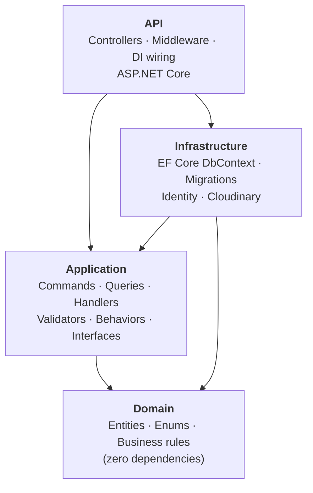
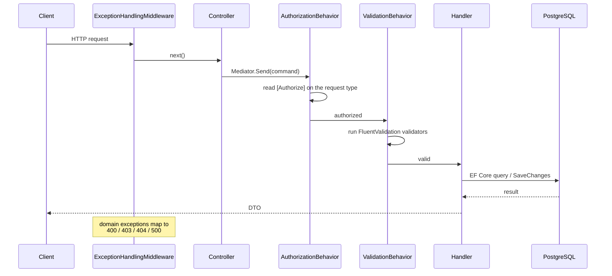
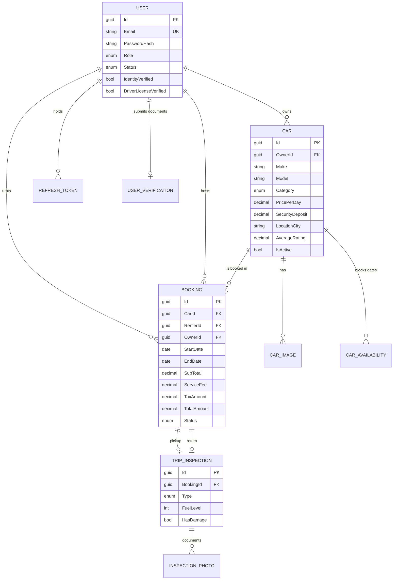
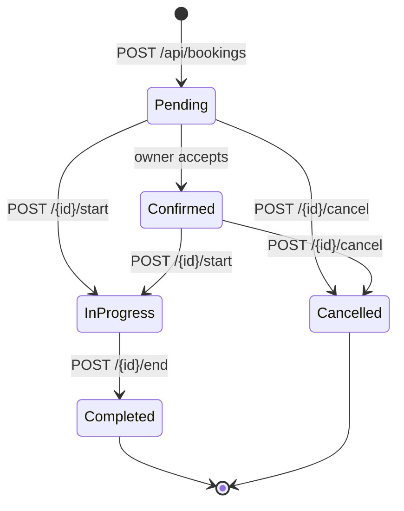

# Car Rental Platform — .NET 9 Backend

A peer-to-peer car rental REST API built with **Clean Architecture** and **CQRS**. Owners list vehicles, renters search by location/date/features, and every booking runs through a full trip lifecycle with pickup and return inspections.

This repository is the backend. It is the part I built to practise production API design: layered dependencies, a MediatR pipeline that handles cross-cutting concerns, JWT auth with refresh-token rotation, and EF Core against PostgreSQL.


---

## Table of contents

- [Tech stack](#tech-stack)
- [Architecture](#architecture)
- [Request pipeline](#request-pipeline)
- [Security](#security)
- [Domain model](#domain-model)
- [Booking lifecycle](#booking-lifecycle)
- [Implementation highlights](#implementation-highlights)
- [API reference](#api-reference)
- [Getting started](#getting-started)
- [Project layout](#project-layout)
- [Roadmap](#roadmap)

---

## Tech stack

| Concern | Choice |
| --- | --- |
| Runtime | .NET 9 / ASP.NET Core |
| Architecture | Clean Architecture + CQRS |
| Messaging | MediatR 14 (in-process) |
| Persistence | EF Core 9 + Npgsql → PostgreSQL |
| Validation | FluentValidation 12 (pipeline behavior) |
| Auth | JWT bearer + rotating refresh tokens, BCrypt hashing |
| File storage | Cloudinary (car photos, verification documents) |
| API docs | Swagger / Swashbuckle with bearer auth support |

---

## Architecture

Four projects, with dependencies pointing **inwards only**. `Domain` references nothing; `Application` depends on `Domain` and defines interfaces it needs; `Infrastructure` implements those interfaces; `API` wires everything up at startup and is the only project that knows about HTTP.



The payoff of the dependency rule: `Application` talks to the database through `IAppDbContext`, to storage through `ICloudinaryService`, and to auth through `IIdentityService` — all declared in `Application/Common/Interfaces`. No handler references Npgsql, Cloudinary, or `HttpContext`, so the business logic stays testable and the persistence choice stays swappable.

---

## Request pipeline

Controllers do no work beyond mapping an HTTP request to a command or query and handing it to MediatR. Everything cross-cutting lives in the pipeline, so it is impossible to forget.



The three pieces that make this work:

- **`ValidationBehavior<TRequest, TResponse>`** — resolves every `IValidator<TRequest>` registered in the assembly and throws a domain `ValidationException` before the handler ever runs.
- **`AuthorizationBehavior<TRequest, TResponse>`** — reads the `[Authorize]` attribute off the *request type* via reflection and checks the caller's role. Authorization is a property of the use case, not of the controller action.
- **`ExceptionHandlingMiddleware`** — the single place that turns exceptions into status codes. `ValidationException` → `400` with a field-level error payload, `NotFoundException` → `404`, `ForbiddenAccessException` → `403`, anything else → logged and returned as a generic `500` so internals never leak to the client.

A controller action, in full:

```csharp
[HttpGet("{id:guid}")]
public async Task<IActionResult> GetBookingById(Guid id)
    => Ok(await Mediator.Send(new GetBookingByIdQuery(id)));
```

---

## Security

- **JWT bearer tokens** signed with HMAC-SHA256, carrying `NameIdentifier`, `Email`, and `Role` claims. Issuer, audience, and lifetime are all validated, with `ClockSkew` set to zero rather than the 5-minute default.
- **Refresh-token rotation** — refresh tokens are 64 bytes from `RandomNumberGenerator`, stored per user. Redeeming one revokes it, records the revoking IP, and links it to its replacement via `ReplacedByToken`, so a reused token is detectable.
- **BCrypt password hashing** with per-password salts, behind an `IPasswordHasher` abstraction.
- **Rate limiting** — a fixed-window limiter of 5 requests/minute on the entire `/api/auth` surface, to blunt credential stuffing.
- **Role-based access** — `Renter`, `Owner`, `Admin`, `Staff`, enforced both by ASP.NET Core policies (`Cars.Manage`, `Bookings.Manage`, `Users.Manage`) and by the MediatR authorization behavior.
- **No secrets in the repository** — `appsettings.json` ships with placeholders; real values come from user secrets or environment variables. See [Getting started](#getting-started).

---

## Domain model



Entity configuration is kept out of the entities themselves and lives in `Infrastructure/Data/Configurations` as `IEntityTypeConfiguration<T>` classes, so the domain stays free of persistence attributes.

---

## Booking lifecycle

A booking is a state machine, and transitions are guarded in the handlers rather than left to the caller.



Starting a trip records a **pickup inspection** (mileage, fuel level, cleanliness, damage notes); ending one records a **return inspection** and closes out the booking. That pairing is what makes damage and mileage disputes resolvable.

---

## Implementation highlights

The two pieces I would point at in a code review:

**Availability-aware search** (`SearchCarsQueryHandler`) — filters cars by city, state, price range, category, rating, and six feature flags, then excludes anything unavailable in the requested window using two subqueries composed into the main `IQueryable`: owner-defined blackout dates from `CarAvailabilities`, and overlapping `Confirmed`/`InProgress` bookings. Both use the standard half-open overlap test (`existing.Start < requested.End && existing.End > requested.Start`). The whole thing stays a single `IQueryable`, so filtering, counting, ordering, and pagination all execute as SQL — the projection into `CarSearchResultDto` happens server-side too, so unneeded columns are never fetched. The query is `AsNoTracking()` since nothing is written back.

**Pricing computed server-side** (`CreateBookingCommandHandler`) — the client sends a car and a date range, never an amount. The handler resolves the car's current `PricePerDay`, derives the day count, and applies a 10% service fee and 5% tax, snapshotting each component (`PricePerDay`, `SubTotal`, `ServiceFee`, `TaxAmount`, `SecurityDeposit`) onto the booking row so a later price change cannot rewrite an existing booking's history.

---

## API reference

All routes are prefixed `/api`. Bearer token required except where noted.

### Auth — `/api/auth` (rate limited: 5 req/min)

| Method | Route | Description | Auth |
| --- | --- | --- | --- |
| `POST` | `/register` | Create an account, returns access + refresh token | Anonymous |
| `POST` | `/login` | Exchange credentials for tokens | Anonymous |
| `POST` | `/refresh` | Rotate a refresh token | Anonymous |
| `POST` | `/logout` | Revoke a refresh token | Anonymous |

### Cars — `/api/cars`

| Method | Route | Description |
| --- | --- | --- |
| `GET` | `/search` | Filter by city, state, dates, price, category, features, rating — paginated |
| `GET` | `/` | List all cars |
| `GET` | `/{id}` | Car detail |
| `POST` | `/` | Create a listing |
| `PUT` | `/{id}` | Update a listing |
| `DELETE` | `/{id}` | Remove a listing |
| `POST` | `/{id}/images` | Upload a photo (multipart → Cloudinary) |
| `DELETE` | `/images/{imageId}` | Delete a photo |

### Bookings — `/api/bookings`

| Method | Route | Description |
| --- | --- | --- |
| `POST` | `/` | Create a booking — checks availability, computes pricing |
| `GET` | `/` | Search by renter, owner, status, date range — paginated |
| `GET` | `/{id}` | Booking detail |
| `POST` | `/{id}/cancel` | Cancel with a reason |
| `POST` | `/{id}/start` | Start trip + pickup inspection |
| `POST` | `/{id}/end` | End trip + return inspection |

### Users — `/api/users`

| Method | Route | Description |
| --- | --- | --- |
| `POST` | `/` | Create a user |
| `GET` | `/{id}` | User detail |
| `PUT` | `/{id}` | Update profile |
| `DELETE` | `/{id}` | Delete a user |
| `POST` | `/{id}/verification` | Upload a government ID or licence scan |
| `GET` | `/pending-verifications` | Review queue for staff |
| `POST` | `/{id}/process-verification` | Approve or reject a document |

Interactive docs are served at `/swagger` when running in Development.

---

## Getting started

### Prerequisites

- [.NET 9 SDK](https://dotnet.microsoft.com/download/dotnet/9.0)
- [PostgreSQL 14+](https://www.postgresql.org/download/)
- A [Cloudinary](https://cloudinary.com/) account (free tier is enough) for image uploads

### 1. Clone and restore

```bash
git clone https://github.com/omarabbas32/CarRentalWebApp.git
cd CarRentalWebApp/backend
dotnet restore
```

### 2. Configure secrets

`appsettings.json` contains placeholders only. Supply real values with the .NET user-secrets manager so nothing lands in git:

```bash
cd API
dotnet user-secrets init
dotnet user-secrets set "ConnectionStrings:DefaultConnection" "Host=localhost;Port=5432;Database=CarRentalDb;Username=postgres;Password=<your-password>"
dotnet user-secrets set "JwtSettings:Secret" "<a random string of at least 32 characters>"
dotnet user-secrets set "Cloudinary:CloudName" "<cloud-name>"
dotnet user-secrets set "Cloudinary:ApiKey" "<api-key>"
dotnet user-secrets set "Cloudinary:ApiSecret" "<api-secret>"
```

Environment variables work too, using `__` as the section separator — for example `ConnectionStrings__DefaultConnection`.

### 3. Create the database

```bash
cd ..
dotnet ef database update --project Infrastructure --startup-project API
```

### 4. Run

```bash
dotnet run --project API
```

Then open `https://localhost:<port>/swagger`. The port is printed on startup and configured in `API/Properties/launchSettings.json`.

---

## Project layout

```
backend/
├── API/                        ASP.NET Core host
│   ├── Controllers/            thin controllers over MediatR
│   ├── Middleware/             global exception → status code mapping
│   ├── Requests/               HTTP request contracts
│   ├── Services/               CurrentUserService (claims → ICurrentUserService)
│   └── Program.cs              DI, auth, rate limiting, Swagger
├── Application/                use cases — no framework dependencies
│   ├── Auth/ Bookings/ Cars/ Users/
│   │   ├── Commands/           write operations + validators
│   │   ├── Queries/            read operations
│   │   └── Common/             DTOs
│   ├── Behaviors/              validation + authorization pipeline
│   └── Common/                 interfaces, exceptions, security attributes
├── Domain/                     entities and enums, zero dependencies
│   ├── Booking/ Car/ User/
└── Infrastructure/             the outside world
    ├── Data/                   DbContext + IEntityTypeConfiguration classes
    ├── Migrations/             EF Core migrations
    ├── Identity/               JWT issuance, BCrypt hashing
    └── Files/                  Cloudinary uploads
```

---

## Roadmap

Planned next, in priority order:

- **Test suite.** Handlers depend only on `IAppDbContext`, so they run against the EF Core in-memory or SQLite provider with no database involved. Unit tests over the pricing and availability rules come first, then integration tests across the pipeline behaviors.
- **Database-level booking concurrency.** A PostgreSQL exclusion constraint on `(car_id, daterange)` moves the non-overlap guarantee into the engine, so it holds under simultaneous requests rather than relying on an application-level check.
- **Typed domain exceptions throughout.** Business-rule failures such as an unavailable car or invalid credentials get their own exception types and map to `409` and `401`, joining the `400`/`403`/`404` cases the middleware already handles.
- **Full `[Authorize]` coverage**, plus the policy branch of `AuthorizationBehavior` backed by an `IsInPolicyAsync` on `ICurrentUserService` to complement the role checks already in place.
- **Payments, messaging, reviews, and notifications.** The entities and their relationships are modelled; the use cases and endpoints come next.
- **Frontend.** The API is designed to serve a SPA from the reserved `frontend/` directory.

---

## Contributing

1. Fork the project.
2. Create a feature branch (`git checkout -b feature/AmazingFeature`).
3. Commit your changes (`git commit -m 'Add AmazingFeature'`).
4. Push the branch (`git push origin feature/AmazingFeature`).
5. Open a pull request.
